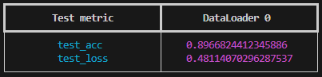

# TAU Vehicle

Решение соревнования ["TAU Vehicle Type Recognition Competition"](https://www.kaggle.com/competitions/vehicle/overview) на платформе Kaggle.

[](https://www.python.org/)
[](https://python-poetry.org/)

## Постановка задачи

Задача заключается в классификации транспортных средств на изображениях по 17 классам. Проект основан на соревновании Kaggle.

### Формат данных

- **Входные данные:** 36 тысяч изображений сцен, содержащих транспортные средства, разделенные на тренировочную и тестовую выборки.
- **Выходные данные:** Для каждого изображения из тестовой выборки необходимо определить номер класса (от 0 до 16). Результаты должны быть сохранены в CSV-файле.

### Метрики

Основная метрика — **Accuracy**

**Целевые показатели:**
Accuracy ≥ 0.9 на тестовой выборке.

## Setup

1. Склонируйте репозиторий

```bash
git clone https://github.com/KIrillPal/tau-vehicle-classification.git
cd tau-vehicle-classification
```

2. Установите зависимости через poetry (dev для pre-коммитов)

```bash
poetry install --with dev
```

3. Установка и запуск pre-commit hooks

```bash
pre-commit install
pre-commit run -a
```

## Train

Скрипт для тренировки реализован через @hydra.main. Конфиги для тренировки и инференса лежат в директории [conf](conf).
Для запуска бейзлайна выполните команду из корня репозитория:

```bash
poetry run python3 -m tau_vehicle train
```

или

```bash
poetry run python3 -m tau_vehicle.src.train
```

Вы также можете указать другой конфиг следующим образом:

```bash
python3 -m tau_vehicle train --config-name=efficientvit_b2
```

Особенности тренировки:

- Данные для тренировки подгружаются через DVC из поднятого хранилища S3: http://109.248.163.128:9000
- Логирование организовано через собственный MLFlow: http://109.248.163.128:5000/#/experiments/621882993446461474
- Вся конфигурация, включая выбор оптимизатора и шедлера, выполнена через Hydra
- Реализован класс HuggingFaceModel, подгружающий модели с HuggingFace
- Всё обучение организовано через PyTorch Lightning
- Обучение нельзя начать, если в репозитории есть незакоммиченные изменения.
  Поскольку MLFlow логирует коммит, всё должно быть зафиксировано для воспроизводимости.
- Скрипт просит явно ввести имя и описание эксперимента, поскольку на практике выяснено, что такая организация помогает не забыть внести актуальное описание эксперимента.
- Локально веса сохраняются в <папка с экспериментами>/<имя эксперимента>/<имя запуска>. Все имена конфигурируются.
- После окончания тренировки лучшая по валидации модель проверяется на тесте. Выводится табличка. Пример:

- 

## Production preparation

Обучение сохраняет чекпоинты, чтобы получить модель в формате для инференса (.pt, .onnx, .engine) используется модуль export.

### Формат PyTorch

```bash
python3 -m tau_vehicle export to_pt --ckpt_path=/path/to/model.ckpt [--output_path=/path/to/output.pt] [--config_name=baseline] [--config_dir=../../conf]
```

### Формат ONNX

```bash
python3 -m tau_vehicle export to_onnx --ckpt_path=/path/to/model.ckpt [--output_path=/path/to/output.onnx] [--config_name=baseline] [--config_dir=../../conf] [--input_names=input] [--output_names=output] [--opset_version=11]
```

### Формат TensorRT

```bash
python3 -m tau_vehicle export to_engine --ckpt_path=/path/to/model.ckpt [--output_path=/path/to/output.engine] [--config_name=baseline] [--config_dir=../../conf] [--fp16_mode=False]
```

### Параметры

#### Общие:

- `ckpt_path`: Путь к входному файлу в разрешении '.ckpt' (обязательно)
- `output_path`: Путь к выходному файлу (необязательно, по умолчанию используется тот же каталог, что и для ввода)
- `config_name`: Имя конфигурационного файла (необязательно, по умолчанию используется 'baseline')
- `config_dir`: Каталог, содержащий конфигурационные файлы (необязательно, по умолчанию используется '../../conf')

#### Параметры, специфичные для ONNX:

- `input_names`: Список входных имен (необязательно, по умолчанию используется ["input"])
- `output_names`: Список выходных имен (необязательно, по умолчанию используется ["output"])
- `dynamic_axes`: Dict, указывающий динамические оси (необязательно)
- `opset_version`: Для ost-версии (необязательно, значение по умолчанию равно 11)

#### Параметры, специфичные для TensorRT:

- `fp16_mode`: Флаг точности FP16 (по умолчанию False)

Пример:
Для удобства вы можете, не обучая модель, загузить чекпоинт для тестирования:

```bash
poetry run dvc pull # актуализирует данные и чекпоинты
```

Из корня репозитория

```bash
python3 -m tau_vehicle export to_engine checkpoints/best.ckpt
```

## Inference

В данном пакете реализованы два метода инференса.

1. Предсказание по папке изображений. В результате сохраняется yaml файл, содержащий для каждого изображения предсказанный класс. Пример [файла](examples/best_predictions.yaml).
   Пример (из корня репозитория):

```bash
python3 -m tau_vehicle infer conf/infer/baseline.yaml data/private/test
```

2. Интерактивный режим. Пользователь вводит путь к изображению, программа печатает предсказанный класс.
   Пример (из корня репозитория):

```bash
python3 -m tau_vehicle infer conf/infer/baseline.yaml
```

Конфигурация для инференса задает информацию о препроцессе изображений, путь к модели, имена классов.
Скрипт поддерживает инференс форматов '.pt' и '.onnx'.

### Параметры

- `config_path`: Путь к файлу конфигурации YAML для инференса
- `image_dir`: Каталог с изображениями для классификации (опционально, если указан, то метод 1. Иначе 2)
- `output_path`: Путь к файлу вывода YAML (по умолчанию: predictions.yaml)
